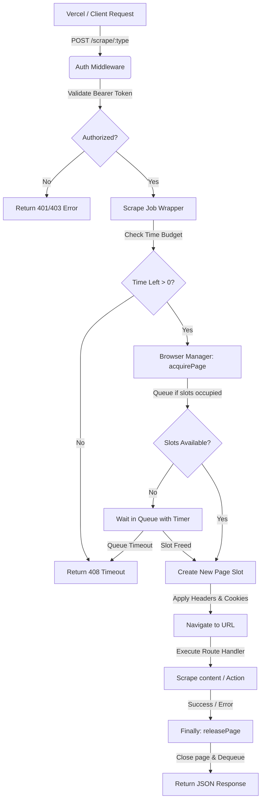

# HeadLock 🔒

A high-performance, private, self-hosted headless browser scraping API running Playwright (Chromium) inside a Docker container. Specially optimized for cost-free deployment on **Hugging Face Spaces** as a secure, personal alternative to services like Browserless.io.

🛡️ **Bearer Token Protected** | ⚡ **~250ms Scrapes (Eager Warm-up)** | 📦 **Connection-Pooled & Leak-Proof**

🔗 **[Live Demo Dashboard](https://willyevergreen-headlock.hf.space)** *(Public Status & Real-time Stats)*

---

## 🚀 Why HeadLock?

Running headless Chromium inside serverless functions (like Vercel) causes massive bundle size inflation, slow cold-starts, and CPU limits. Running it on commercial platforms is expensive.

**HeadLock** solves this by maintaining a persistent, connection-pooled Chromium instance inside a free Hugging Face Docker Space. Eagerly initialized on server startup, it eliminates browser boot delays, completing scrapes in as little as **250ms** while remaining **100% cost-free**.

---

## 🏗️ Request Lifecycle & Architecture

<details>
<summary>🗺️ View Request-Response Workflow Diagram</summary>



</details>

### Key Features
* ⚡ **Zero-Latency Launch**: Launches a persistent Chromium browser eagerly on server boot, removing launch latency from the request path.
* 🛡️ **Rate Limiting & Backpressure**: Limits active tabs (`MAX_CONCURRENT`) and queues overflow requests (`MAX_QUEUE`) to prevent container memory leaks.
* 🛑 **Anti-Leak Assurance**: Scrape operations are managed inside structured resource wrappers that guarantee page cleanup even on timeouts or navigation errors.
* 🌍 **Dynamic CORS Ingress**: Wildcard CORS configuration allows secure requests from dynamic Vercel deployments and resolves origin changes gracefully.

---

## 📡 API Endpoints

All scraping endpoints require an `Authorization: Bearer <SECRET_TOKEN>` header.

| Method | Endpoint | Description | Returns |
| :--- | :--- | :--- | :--- |
| `POST` | `/scrape/html` | Extract raw fully-rendered HTML (supports custom delays). | HTML Page Source |
| `POST` | `/scrape/text` | Extract inner text content of a specific page element. | Inner Text Content |
| `POST` | `/scrape/screenshot` | Capture high-fidelity base64 PNG screenshot (supports full-page). | Base64 PNG String |
| `POST` | `/scrape/pdf` | Render print-ready base64 PDF of the webpage. | Base64 PDF String |
| `POST` | `/scrape/json` | Evaluate arbitrary JS code inside the browser page context. | Custom JS Return Object |
| `GET` | `/health` | Fetch public server uptime and connection pool stats. | JSON Pool Stats |

---

## ⚡ Quick Start

### 1. Deploy to Hugging Face
1. Create a **Docker Space** on [huggingface.co](https://huggingface.co/).
2. Under Space **Settings > Secrets & Variables**, add:
   * **Secret**: `SECRET_TOKEN` = `your-secure-auth-token`
   * **Variables**: `MAX_CONCURRENT=3`, `PAGE_TIMEOUT=30000`
3. Add the remote and push:
   ```bash
   git remote add hf https://huggingface.co/spaces/YOUR_USERNAME/YOUR_SPACE
   git push hf main --force
   ```

### 2. Configure Keepalive (UptimeRobot)
To prevent your free Hugging Face Space from falling asleep after 48 hours of inactivity, set up a free HTTP(S) monitor on **[UptimeRobot](https://uptimerobot.com/)**:
* **Monitor URL**: `https://YOUR_SPACE_URL.hf.space/health` (pings every 5-15 mins).

### 3. Vercel / Next.js Integration
Install the lightweight client helper `lib/scraper.js` in your frontend and configure your environment variables:
```javascript
import { scrape } from '@/lib/scraper';

// Perform a secure, high-speed HTML scrape in Next.js Server Actions / API Routes
const data = await scrape('html', { 
  url: 'https://example.com', 
  waitFor: '.loaded-content' 
});
console.log(data.html);
```

---

## 🛠️ Tech Stack & Tooling

* **Runtime**: Node.js & Express
* **Browser Automation**: Playwright (Chromium)
* **Testing**: Jest & Supertest (unit tested)
* **DevOps**: Docker, Hugging Face Spaces

---

📚 **For complete SDK source codes, advanced backoff retry logic, and PDF/screenshot base64 decoding guides, check out [DOCS.md](./DOCS.md).**
