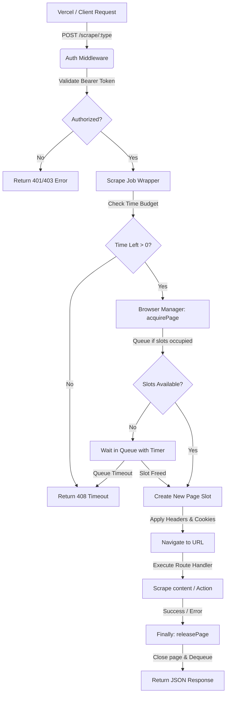

# HeadLock 🔒

A premium, private, self-hosted, headless browser scraping service running Playwright (Chromium) inside a Docker container. Specially optimized for deployment on **Hugging Face Spaces** as a high-performance, private, and 100% cost-free alternative to services like Browserless.io.

Securely protected by Bearer token authentication, this service acts as your personal scraping server, ready to be consumed on-demand by frontend frameworks like Next.js (on Vercel).

---

## 🏗️ System Architecture & Workflow

HeadLock acts as a highly optimized, single-instance connection-pooled Chromium service. Below is the step-by-step request-response workflow diagram:

![HeadLock Workflow](https://mermaid.ink/img/Z3JhcGggVEQKICAgIEFbIlZlcmNlbCAvIENsaWVudCBSZXF1ZXN0Il0gLS0+fCJQT1NUIC9zY3JhcGUvOnR5cGUifCBCKCJBdXRoIE1pZGRsZXdhcmUiKQogICAgQiAtLT58IlZhbGlkYXRlIEJlYXJlciBUb2tlbiJ8IEN7IkF1dGhvcml6ZWQ/In0KICAgIEMgLS0+fE5vfCBEWyJSZXR1cm4gNDAxLzQwMyBFcnJvciJdCiAgICBDIC0tPnxZZXN8IEVbIlNjcmFwZSBKb2IgV3JhcHBlciJdCiAgICBFIC0tPnwiQ2hlY2sgVGltZSBCdWRnZXQifCBGeyJUaW1lIExlZnQgPiAwPyJ9CiAgICBGIC0tPnxOb3wgR1siUmV0dXJuIDQwOCBUaW1lb3V0Il0KICAgIEYgLS0+fFllc3wgSFsiQnJvd3NlciBNYW5hZ2VyOiBhY3F1aXJlUGFnZSJdCiAgICBIIC0tPnwiUXVldWUgaWYgc2xvdHMgb2NjdXBpZWQifCBJeyJTbG90cyBBdmFpbGFibGU/In0KICAgIEkgLS0+fE5vfCBKWyJXYWl0IGluIFF1ZXVlIHdpdGggVGltZXIiXQogICAgSSAtLT58WWVzfCBLWyJDcmVhdGUgTmV3IFBhZ2UgU2xvdCJdCiAgICBKIC0tPnwiUXVldWUgVGltZW91dCJ8IEcKICAgIEogLS0+fCJTbG90IEZyZWVkInwgSwogICAgSyAtLT58IkFwcGx5IEhlYWRlcnMgJiBDb29raWVzInwgTFsiTmF2aWdhdGUgdG8gVVJMIl0KICAgIEwgLS0+fCJFeGVjdXRlIFJvdXRlIEhhbmRsZXIifCBNWyJTY3JhcGUgY29udGVudCAvIEFjdGlvbiJdCiAgICBNIC0tPnwiU3VjY2VzcyAvIEVycm9yInwgTlsiRmluYWxseTogcmVsZWFzZVBhZ2UiXQogICAgTiAtLT58IkNsb3NlIHBhZ2UgJiBEZXF1ZXVlInwgT1siUmV0dXJuIEpTT04gUmVzcG9uc2UiXQ==)

<details>
<summary>💻 View Mermaid Flowchart Source</summary>



</details>

### Key Engineering Details
1. **Shared Browser Pool**: Launches a single, persistent headless Chromium instance on startup rather than launching a new browser process for every request, reducing response times by up to **90%**.
2. **Intelligent Queueing**: Regulates active tabs using a strict concurrency threshold (`MAX_CONCURRENT`). Over-capacity requests are held in an asynchronous queue and dispatched immediately when slots become available.
3. **Budgeted Timeouts**: Computes remaining time during queue waits. If a request sits in the queue too long, it is safely canceled and a `408 Request Timeout` is returned, preventing resource leaks.
4. **Auto-Recovery**: Automatically listens for browser disconnects or crashes, flushing old queues gracefully and spinning up a healthy Chromium instance on subsequent calls.

---

## ✨ Features

* **Single Shared Instance**: Re-uses one Playwright Chromium instance to minimize container startup time and overhead.
* **Connection Queue Pool**: Limits max concurrent browser pages (default `3`). Excess requests are safely queued.
* **Anti-Leak Safeguards**: Page cleanup is automatically performed in a `finally` block under all circumstances (even on navigation errors or timeout budgets).
* **Docker Ready**: Tailored specifically for Hugging Face Spaces Docker specifications (UID 1000 user, port 7860, and cached Playwright system binaries).
* **Vercel Friendly**: Fully compatible with Vercel serverless environments; includes a ready-to-use fetch client wrapper.
* **Robust Error Contexts**: Transparent error messages, mapped HTTP status codes, and execution timings returned on every response.

---

## 📁 Project Structure

```text
/
├── Dockerfile          # Hugging Face Spaces Docker container configuration
├── package.json        # Node.js dependencies & scripts
├── server.js           # Express server bootstrap and graceful shutdown logic
├── .env                # Local development environment keys (git-ignored)
├── .env.example        # Environment template file
├── middleware/
│   └── auth.js         # Bearer token authentication middleware
├── routes/
│   └── scrape.js       # Core scraping routes (html, text, screenshot, pdf, json)
├── utils/
│   └── browser.js      # Concurrency pool & browser queue manager
└── lib/
    └── scraper.js      # Next.js / Vercel client-side fetch helper
```

---

## 🚀 Setup & Deployment Guide

### Local Development

1. **Install Dependencies**:
   ```bash
   npm install
   ```
2. **Configure Environment Variables**:
   Copy `.env.example` to `.env` and fill in your custom values:
   ```bash
   cp .env.example .env
   ```
   *Make sure `SECRET_TOKEN` is a strong, random key.*
3. **Install Chromium Drivers**:
   Ensure Chromium binaries are locally installed:
   ```bash
   npx playwright install chromium
   ```
4. **Start the Development Server**:
   ```bash
   npm run dev
   ```
   The service will start on `http://localhost:7860`.

---

### Deploying to Hugging Face Spaces (Docker)

1. Go to [Hugging Face Spaces](https://huggingface.co/spaces) and click **Create a new Space**.
2. **Configure Space settings**:
   * **Name**: (e.g., `my-private-scraper`)
   * **SDK**: `Docker`
   * **Template**: `Blank`
   * **Space Visibility**: `Public` (Secure internally via your `SECRET_TOKEN`)
3. Click **Create Space**.
4. In the Space **Settings**, add the following under **Variables and Secrets**:
   * **Secrets (Encrypted)**:
     * `SECRET_TOKEN` = `your-super-secure-token-here`
   * **Variables**:
     * `MAX_CONCURRENT` = `3`
     * `PAGE_TIMEOUT` = `30000` *(Max timeout in milliseconds)*
5. Push the project repository to your Hugging Face Space repository:
   ```bash
   git init
   git remote add origin https://huggingface.co/spaces/<your-username>/<your-space-name>
   git add .
   git commit -m "Deploy Headlock Scraping Service"
   git push -u origin main --force
   ```
6. Hugging Face will automatically build and spin up the Docker container. Once complete, your scraper base URL will be:
   `https://<your-username>-<your-space-name>.hf.space`

---

## ⚙️ Environment Variables

| Variable | Description | Default |
| :--- | :--- | :--- |
| `SECRET_TOKEN` | Bearer token required in the `Authorization` header to authenticate requests. | *(Required)* |
| `MAX_CONCURRENT` | Maximum number of concurrent browser page instances. | `3` |
| `PAGE_TIMEOUT` | Max execution limit for any single scrape job in milliseconds. | `30000` |
| `PORT` | Listening port for the Express application. | `7860` |

---

## 📡 API Endpoints Documentation

All scraping requests require an `Authorization: Bearer <SECRET_TOKEN>` header and a JSON body.

### Common Request Payload Attributes
Any scraping endpoint accepts these custom inputs in the JSON payload:
- `headers`: An object containing custom HTTP headers to pass along during navigation.
- `cookies`: An array of cookie objects to inject into the page before loading the URL.

---

### 1. HTML Extraction
Retrieves the raw rendered HTML of a page after it has loaded (and optionally waits for a specific CSS element).

* **Endpoint**: `POST /scrape/html`
* **Payload**:
  ```json
  {
    "url": "https://example.com",
    "waitFor": ".loaded-content-selector" 
  }
  ```
* **Response**:
  ```json
  {
    "html": "<!DOCTYPE html><html>...</html>",
    "status": 200,
    "timeTaken": 1420
  }
  ```

---

### 2. Text Extraction
Extracts the inner text content of a specific page element (defaults to the entire `body`).

* **Endpoint**: `POST /scrape/text`
* **Payload**:
  ```json
  {
    "url": "https://example.com",
    "selector": "h1"
  }
  ```
* **Response**:
  ```json
  {
    "text": "Example Domain",
    "status": 200,
    "timeTaken": 950
  }
  ```

---

### 3. Screen Capture (Screenshot)
Returns a base64 encoded string representing a PNG screenshot. Supports capturing the full page length.

* **Endpoint**: `POST /scrape/screenshot`
* **Payload**:
  ```json
  {
    "url": "https://example.com",
    "fullPage": true
  }
  ```
* **Response**:
  ```json
  {
    "screenshot": "iVBORw0KGgoAAAANSUhEUgA...",
    "status": 200,
    "timeTaken": 2100
  }
  ```

---

### 4. PDF Rendering
Generates a print-ready PDF of the webpage and returns it as a base64 encoded document string.

* **Endpoint**: `POST /scrape/pdf`
* **Payload**:
  ```json
  {
    "url": "https://example.com"
  }
  ```
* **Response**:
  ```json
  {
    "pdf": "JVBERi0xLjQKJdPr6g...",
    "status": 200,
    "timeTaken": 3400
  }
  ```

---

### 5. Custom JavaScript Evaluation
Runs an arbitrary JavaScript expression or function string directly inside the headless browser's page context via Playwright.

* **Endpoint**: `POST /scrape/json`
* **Payload**:
  ```json
  {
    "url": "https://example.com",
    "evaluate": "() => { return { title: document.title, headings: Array.from(document.querySelectorAll('h1')).map(h => h.innerText) } }"
  }
  ```
* **Response**:
  ```json
  {
    "result": {
      "title": "Example Domain",
      "headings": ["Example Domain"]
    },
    "status": 200,
    "timeTaken": 1150
  }
  ```

---

### 6. Health Check (Public)
Monitor server uptime and browser pool statistics. Useful for standard Docker / HF Spaces health-checks. No authentication header required.

* **Endpoint**: `GET /health`
* **Response**:
  ```json
  {
    "status": "ok",
    "uptime": 12400,
    "queueLength": 0,
    "activeSessions": 1
  }
  ```

---

## 🔌 Vercel / Next.js Integration

To integrate this service inside your Vercel (Next.js) project, place the provided client helper file `lib/scraper.js` in your source directory.

### Set Environment Variables in Vercel
In your Vercel dashboard, navigate to **Settings > Environment Variables** and add:
- `SCRAPER_URL` = `https://<your-username>-<your-space-name>.hf.space`
- `SCRAPER_TOKEN` = `your-super-secure-token-here`

### Sample API Route Usage (Next.js Route Handlers)

```javascript
import { scrape } from '@/lib/scraper';
import { NextResponse } from 'next/server';

export async function POST(req) {
  try {
    const { url } = await req.json();

    // Call your private Hugging Face Space scraper securely
    const data = await scrape('html', {
      url,
      waitFor: '.target-element'
    });

    return NextResponse.json({ success: true, html: data.html });
  } catch (error) {
    return NextResponse.json({ success: false, error: error.message }, { status: 500 });
  }
}
```

---

## ⚠️ Error Response Specifications

If an error or timeout occurs, the service guarantees a consistent JSON error shape:

```json
{
  "error": "Request timed out during scraping operation",
  "code": "TIMEOUT",
  "timeTaken": 30000
}
```

### Common Error Codes
- `MISSING_TOKEN` / `INVALID_TOKEN_FORMAT` / `INVALID_TOKEN` (Status 401 / 403)
- `MISSING_URL` / `INVALID_URL` / `MISSING_EVALUATE` (Status 400)
- `TIMEOUT` (Status 408 - if wait in queue or page execution exceeds the `PAGE_TIMEOUT` budget)
- `SCRAPE_ERROR` (Status 500 - generic network or navigation issue)
