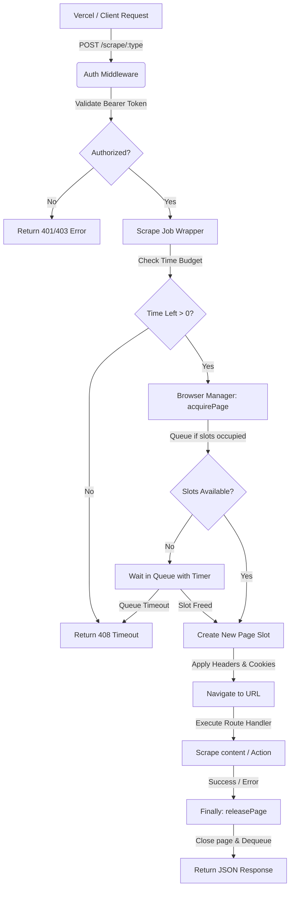

# HeadLock 🔒

A premium, private, self-hosted, headless browser scraping service running Playwright (Chromium) inside a Docker container. Specially optimized for deployment on **Hugging Face Spaces** as a high-performance, private, and 100% cost-free alternative to services like Browserless.io.

Securely protected by Bearer token authentication, this service acts as your personal scraping server, ready to be consumed on-demand by frontend frameworks like Next.js (on Vercel).

---

## 🏗️ System Architecture & Workflow

HeadLock acts as a highly optimized, single-instance connection-pooled Chromium service. Below is the step-by-step request-response workflow diagram:

<details>
<summary>🗺️ Show System Architecture & Workflow Diagram</summary>



</details>

### Key Engineering Details
1. **Shared Browser Pool & Eager Warm-Up**: Launches a single, persistent headless Chromium instance eagerly during server startup. This eliminates cold starts and first-request browser launch delays, reducing response times by up to **90%**.
2. **Intelligent Queueing & Memory Safeguards**: Regulates active tabs using a strict concurrency threshold (`MAX_CONCURRENT`). Over-capacity requests are held in an asynchronous queue up to a maximum safety limit (`MAX_QUEUE`). Saturated queues reject incoming requests immediately with a `429 Too Many Requests` code to prevent server memory exhaustion.
3. **Budgeted Timeouts**: Computes remaining time during queue waits. If a request sits in the queue too long, it is safely canceled and a `408 Request Timeout` is returned, preventing resource leaks.
4. **Auto-Recovery**: Automatically listens for browser disconnects or crashes, flushing old queues gracefully and spinning up a healthy Chromium instance on subsequent calls.
5. **CORS & Dynamic Space Support**: Wildcard CORS configuration allows secure requests from dynamic Vercel deployments and resolves origin changes gracefully if your Hugging Face Space is renamed.

---

## ✨ Features

* **Single Shared Instance**: Re-uses one Playwright Chromium instance to minimize container startup time and overhead.
* **Eager Initialization**: Chromium is launched eagerly on server boot to remove any launch latency from the request path.
* **Connection Queue Pool**: Limits max concurrent browser pages (default `3`). Excess requests are safely queued up to `MAX_QUEUE` (default `10`).
* **Rate Limiting / Backpressure**: Saturated queues are cleanly rejected early with standard `429 Too Many Requests` responses.
* **Anti-Leak Safeguards**: Page cleanup is automatically performed in a `finally` block under all circumstances (even on navigation errors or timeout budgets).
* **Docker Ready**: Tailored specifically for Hugging Face Spaces Docker specifications (UID 1000 user, port 7860, and cached Playwright system binaries).
* **Dynamic CORS Ingress**: Fully supports wildcard CORS preflights to let Vercel serverless functions consume the server easily under any domain.
* **Robust Error Contexts**: Transparent error messages, mapped HTTP status codes, and execution timings returned on every response.

---

## 📁 Project Structure

```text
/
├── Dockerfile          # Hugging Face Spaces Docker container configuration
├── package.json        # Node.js dependencies & scripts
├── server.js           # Express server bootstrap and graceful shutdown logic
├── .env                # Local development environment keys (git-ignored)
├── .env.example        # Environment template file
├── middleware/
│   └── auth.js         # Bearer token authentication middleware
├── routes/
│   └── scrape.js       # Core scraping routes (html, text, screenshot, pdf, json)
├── utils/
│   └── browser.js      # Concurrency pool & browser queue manager
└── lib/
    └── scraper.js      # Next.js / Vercel client-side fetch helper
```

---

## 🚀 Setup & Deployment Guide

### Local Development

1. **Install Dependencies**:
   ```bash
   npm install
   ```
2. **Configure Environment Variables**:
   Copy `.env.example` to `.env` and fill in your custom values:
   ```bash
   cp .env.example .env
   ```
   *Make sure `SECRET_TOKEN` is a strong, random key.*

   > [!TIP]
   > You can generate a strong, secure 32-byte hexadecimal secret token using the following command:
   > ```bash
   > openssl rand -hex 32
   > ```
3. **Install Chromium Drivers**:
   Ensure Chromium binaries are locally installed:
   ```bash
   npx playwright install chromium
   ```
4. **Start the Development Server**:
   ```bash
   npm run dev
   ```
   The service will start on `http://localhost:7860`.

---

### Deploying to Hugging Face Spaces (Docker)

1. Go to [Hugging Face Spaces](https://huggingface.co/spaces) and click **Create a new Space**.
2. **Configure Space settings**:
   * **Name**: (e.g., `my-private-scraper`)
   * **SDK**: `Docker`
   * **Template**: `Blank`
   * **Space Visibility**: `Public` (Secure internally via your `SECRET_TOKEN`)
3. Click **Create Space**.
4. In the Space **Settings**, add the following under **Variables and Secrets**:
   * **Secrets (Encrypted)**:
     * `SECRET_TOKEN` = `your-super-secure-token-here`
   * **Variables**:
     * `MAX_CONCURRENT` = `3` *(Max number of browser tabs running concurrently)*
     * `MAX_QUEUE` = `10` *(Max request queue size to prevent memory pileups)*
     * `PAGE_TIMEOUT` = `30000` *(Max timeout in milliseconds for a scraping job)*
5. Push the project repository to your Hugging Face Space repository:
   ```bash
   git init
   git remote add origin https://huggingface.co/spaces/<your-username>/<your-space-name>
   git add .
   git commit -m "Deploy Headlock Scraping Service"
   git push -u origin main --force
   ```
6. Hugging Face will automatically build and spin up the Docker container. Once complete, your scraper base URL will be:
   `https://<your-username>-<your-space-name>.hf.space`

   > [!IMPORTANT]
   > **Preventing Hugging Face Space Sleep (Uptime Keepalive)**:
   > Free Hugging Face Spaces scale to zero (go to sleep) after 48 hours of inactivity. When asleep, your first request will experience a 30-60 second container boot delay.
   > 
   > To keep your connection pool warm and running 24/7/365 permanently, configure a free monitor on **[UptimeRobot](https://uptimerobot.com/)**:
   > 1. Register a free account on [UptimeRobot](https://uptimerobot.com/).
   > 2. Click **Add New Monitor** and select monitor type **HTTP(S)**.
   > 3. Set the **Friendly Name** (e.g., `HeadLock Keepalive`).
   > 4. Set the **URL/IP** to: `https://<your-username>-<your-space-name>.hf.space/health` (Note: `/health` is a public endpoint and does not require credentials/tokens).
   > 5. Set the **Monitoring Interval** to **Every 5 minutes** or **Every 15 minutes** (well under the 48-hour threshold).
   > 6. Click **Create Monitor**.
   > 
   > This keeps the Space continuously hot and will instantly alert you if your service ever encounters issues.

---

## ⚙️ Environment Variables

| Variable | Description | Default |
| :--- | :--- | :--- |
| `SECRET_TOKEN` | Bearer token required in the `Authorization` header to authenticate requests. | *(Required)* |
| `MAX_CONCURRENT` | Maximum number of concurrent browser page instances (tabs). | `3` |
| `MAX_QUEUE` | Maximum number of requests that can wait in the queue before being rejected with a `429` status code. | `10` |
| `PAGE_TIMEOUT` | Max execution limit for any single scrape job in milliseconds. | `30000` |
| `PORT` | Listening port for the Express application. | `7860` |

---

## 📡 API Endpoints Documentation

All scraping requests require an `Authorization: Bearer <SECRET_TOKEN>` header and a JSON body.

### Common Request Payload Attributes
Any scraping endpoint accepts these custom inputs in the JSON payload:
- `headers`: An object containing custom HTTP headers to pass along during navigation.
- `cookies`: An array of cookie objects to inject into the page before loading the URL.

---

### 1. HTML Extraction
Retrieves the raw rendered HTML of a page after it has loaded (and optionally waits for a specific CSS element).

* **Endpoint**: `POST /scrape/html`
* **Payload**:
  ```json
  {
    "url": "https://example.com",
    "waitFor": ".loaded-content-selector" 
  }
  ```
* **Response**:
  ```json
  {
    "html": "<!DOCTYPE html><html>...</html>",
    "status": 200,
    "timeTaken": 1420
  }
  ```

---

### 2. Text Extraction
Extracts the inner text content of a specific page element (defaults to the entire `body`).

* **Endpoint**: `POST /scrape/text`
* **Payload**:
  ```json
  {
    "url": "https://example.com",
    "selector": "h1"
  }
  ```
* **Response**:
  ```json
  {
    "text": "Example Domain",
    "status": 200,
    "timeTaken": 950
  }
  ```

---

### 3. Screen Capture (Screenshot)
Returns a base64 encoded string representing a PNG screenshot. Supports capturing the full page length.

* **Endpoint**: `POST /scrape/screenshot`
* **Payload**:
  ```json
  {
    "url": "https://example.com",
    "fullPage": true
  }
  ```
* **Response**:
  ```json
  {
    "screenshot": "iVBORw0KGgoAAAANSUhEUgA...",
    "status": 200,
    "timeTaken": 2100
  }
  ```

---

### 4. PDF Rendering
Generates a print-ready PDF of the webpage and returns it as a base64 encoded document string.

* **Endpoint**: `POST /scrape/pdf`
* **Payload**:
  ```json
  {
    "url": "https://example.com"
  }
  ```
* **Response**:
  ```json
  {
    "pdf": "JVBERi0xLjQKJdPr6g...",
    "status": 200,
    "timeTaken": 3400
  }
  ```

---

### 5. Custom JavaScript Evaluation
Runs an arbitrary JavaScript expression or function string directly inside the headless browser's page context via Playwright.

* **Endpoint**: `POST /scrape/json`
* **Payload**:
  ```json
  {
    "url": "https://example.com",
    "evaluate": "() => { return { title: document.title, headings: Array.from(document.querySelectorAll('h1')).map(h => h.innerText) } }"
  }
  ```
* **Response**:
  ```json
  {
    "result": {
      "title": "Example Domain",
      "headings": ["Example Domain"]
    },
    "status": 200,
    "timeTaken": 1150
  }
  ```

---

### 6. Health Check (Public)
Monitor server uptime and browser pool statistics. Useful for standard Docker / HF Spaces health-checks. No authentication header required.

* **Endpoint**: `GET /health`
* **Response**:
  ```json
  {
    "status": "ok",
    "uptime": 12400,
    "queueLength": 0,
    "activeSessions": 1
  }
  ```

---

## 🔌 Vercel / Next.js Integration

To integrate this service inside your Vercel (Next.js) project, implement the client helper and environment settings as outlined below.

### 1. Set Environment Variables in Vercel
In your Vercel dashboard, navigate to **Settings > Environment Variables** and add:
- `SCRAPER_URL` = `https://<your-username>-<your-space-name>.hf.space`
- `SCRAPER_TOKEN` = `your-super-secure-token-here`

### 2. Client SDK Helper (`lib/scraper.js`)
Save the following complete source code into `lib/scraper.js` in your Next.js project:

```javascript
/**
 * HeadLock Scraper client wrapper for Next.js / Vercel projects.
 * 
 * Ready-to-use fetch wrapper for calling your private Hugging Face Space.
 * Make sure to define SCRAPER_URL and SCRAPER_TOKEN in your Vercel environment.
 * 
 * @param {('html'|'text'|'screenshot'|'pdf'|'json')} type - Scrape action type.
 * @param {Object} payload - Scrape configurations.
 * @param {string} payload.url - Webpage URL to scrape.
 * @param {string} [payload.waitFor] - For 'html': Wait for CSS selector to load.
 * @param {string} [payload.selector] - For 'text': Extract text inside CSS selector (defaults to 'body').
 * @param {boolean} [payload.fullPage] - For 'screenshot': Take a full page screenshot.
 * @param {string} [payload.evaluate] - For 'json': Evaluate custom JS function string in page.
 * @param {Object} [payload.headers] - Inject custom HTTP headers.
 * @param {Array<Object>} [payload.cookies] - Inject session/auth cookies.
 * 
 * @returns {Promise<Object>} Response object containing output data and execution stats.
 */
export async function scrape(type, payload) {
  const scraperUrl = process.env.SCRAPER_URL;
  const scraperToken = process.env.SCRAPER_TOKEN;

  if (!scraperUrl) {
    throw new Error("SCRAPER_URL environment variable is missing on Vercel.");
  }
  if (!scraperToken) {
    throw new Error("SCRAPER_TOKEN environment variable is missing on Vercel.");
  }

  // Ensure trailing slash is cleaned
  const sanitizedUrl = scraperUrl.replace(/\/$/, "");

  const res = await fetch(`${sanitizedUrl}/scrape/${type}`, {
    method: 'POST',
    headers: {
      'Content-Type': 'application/json',
      'Authorization': `Bearer ${scraperToken}`
    },
    body: JSON.stringify(payload)
  });

  if (!res.ok) {
    let errMsg = `Server responded with ${res.status}`;
    try {
      const errJson = await res.json();
      if (errJson.error) {
        errMsg = errJson.error;
      }
    } catch (_) {}
    
    const error = new Error(errMsg);
    error.status = res.status;
    throw error;
  }

  return res.json();
}
```

### 3. Advanced Usage & Error Recovery (Next.js Route Handler)
Below is an advanced Next.js Route Handler demonstrating how to:
1. Implement **automated retries with exponential backoff** for robust handling of `408 Timeout` and `429 Too Many Requests` (saturated queues).
2. **Decode and render/download base64 screenshots and PDFs** returned by the scraper.

```javascript
import { scrape } from '@/lib/scraper';
import { NextResponse } from 'next/server';

/**
 * Robust Scraping Fetch Wrapper with Concurrency Backoff Retry Logic
 */
async function scrapeWithRetry(type, payload, maxRetries = 3, delayMs = 1500) {
  for (let attempt = 1; attempt <= maxRetries; attempt++) {
    try {
      return await scrape(type, payload);
    } catch (error) {
      const isRetryable = error.status === 408 || error.status === 429;
      if (!isRetryable || attempt === maxRetries) {
        throw error;
      }
      
      console.warn(`[Scraper] Attempt ${attempt} failed (Status ${error.status}). Retrying in ${delayMs * attempt}ms...`);
      await new Promise(res => setTimeout(res, delayMs * attempt)); // Exponential wait
    }
  }
}

export async function POST(req) {
  try {
    const { url, type } = await req.json();

    if (type === 'screenshot') {
      // 1. Fetch screenshot base64 payload with robust queue retry
      const data = await scrapeWithRetry('screenshot', { url, fullPage: true });
      
      // Frontend consumption tip: Send as base64 data URL to render in an  tag instantly
      const screenshotDataUrl = `data:image/png;base64,${data.screenshot}`;
      return NextResponse.json({ success: true, image: screenshotDataUrl });
    }

    if (type === 'pdf') {
      // 2. Fetch PDF base64 payload
      const data = await scrapeWithRetry('pdf', { url });
      
      // Send the raw binary PDF file buffer back to the user for direct browser download/rendering
      const pdfBuffer = Buffer.from(data.pdf, 'base64');
      return new NextResponse(pdfBuffer, {
        status: 200,
        headers: {
          'Content-Type': 'application/pdf',
          'Content-Disposition': `attachment; filename="scraped-${Date.now()}.pdf"`
        }
      });
    }

    // 3. Fallback: Default HTML extraction
    const data = await scrapeWithRetry('html', { url });
    return NextResponse.json({ success: true, html: data.html });

  } catch (error) {
    console.error('[API Router Error]:', error.message);
    return NextResponse.json(
      { success: false, error: error.message }, 
      { status: error.status || 500 }
    );
  }
}
```

---

## ⚠️ Error Response Specifications

If an error or timeout occurs, the service guarantees a consistent JSON error shape:

```json
{
  "error": "Request timed out during scraping operation",
  "code": "TIMEOUT",
  "timeTaken": 30000
}
```

### Common Error Codes
- `MISSING_TOKEN` / `INVALID_TOKEN_FORMAT` / `INVALID_TOKEN` (Status 401 / 403)
- `MISSING_URL` / `INVALID_URL` / `MISSING_EVALUATE` (Status 400)
- `TIMEOUT` (Status 408 - if wait in queue or page execution exceeds the `PAGE_TIMEOUT` budget)
- `SCRAPE_ERROR` (Status 500 - generic network or navigation issue)
